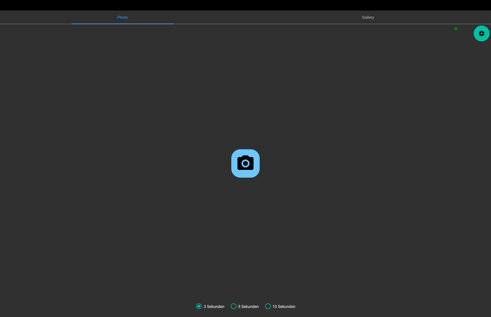

# PiPhotoBooth



This is a simple Photo Booth Application written in C# with 
[Avalonia UI](https://github.com/AvaloniaUI/Avalonia) using the 
[GPhoto2](http://www.gphoto.org/) library.

## Getting started

### Prerequistes
[.Net 8 Runtime](https://dotnet.microsoft.com/en-us/download/dotnet/8.0) 
must be installed on the System.

To use a connected camery, [GPhoto2](http://www.gphoto.org/) must be
installed on the system. 

### Run the app

```
cd PiPhotoBooth.Presentation
dotnet run
```

### Deploy the app

For Linux/Raspberry Pi

```
dotnet publish -c Release -r linux-arm --self-contained -o ./publish
``` 

### Use the app

#### First start
On the first start the Settings Window will open automatically.
You have to set at lease the Directory in which the photos will be stored.

#### Settings


**Photo Directory**: The path to the local directory where the jpeg photos
from the camera will be downloaded and stored.

**Use Fake Camera Control**: When Ghoto2 is not installed on the system, 
a fake camery control can be used. The Fake Control will download pictures
from [LoremPicsum](https://picsum.photos/) when a photo is taken.

#### Photo view


[1] **Is camera online**: An indicator that shows if the camera is
online and connected. Green: camera is online; Red: No camera found.

[2] **Settings button**: Opens the settings window.

[3] **Countdown length**: Set the duration of the countdown, before a 
phot is taken.

[4] **Take photo**: Starts the countdown and takes a photo. 